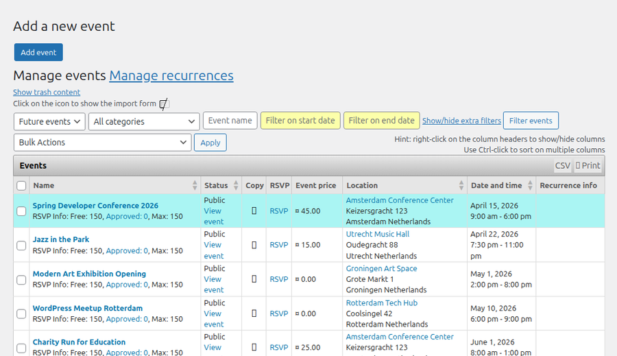
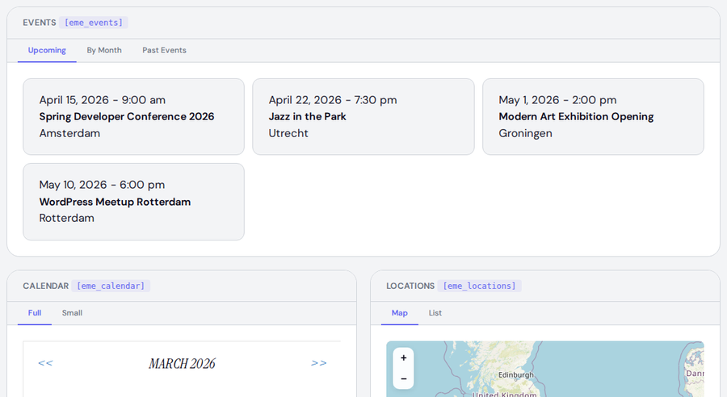
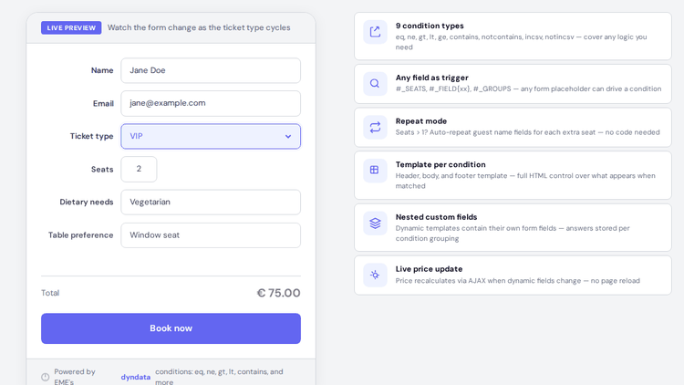

<p align="center">
  
</p>

<div align="center">

[](https://www.gnu.org/licenses/gpl-2.0)
[](https://wordpress.org/)
[](https://www.php.net/)
[](https://www.classicpress.net/)

[Documentation](https://www.e-dynamics.be/wordpress/eme-docs/) &middot; [Report Issue](https://github.com/liedekef/events-made-easy/issues) &middot; [Sponsor](https://github.com/sponsors/liedekef)

---

</div>

## Features at a glance

| | Feature | Description |
|:---:|---|---|
| :calendar: | **Events** | Public, private, draft & recurring events with daily/weekly/monthly/custom recurrence |
| :ticket: | **Bookings & RSVP** | Custom booking forms, seat management, optional approval, waiting list |
| :credit_card: | **16 Payment Gateways** | Stripe, Mollie, PayPal, Braintree, SumUp, Opayo, and 10 more |
| :busts_in_silhouette: | **Memberships** | Recurring subscriptions, content protection, PDF membership cards |
| :world_map: | **Maps** | OpenStreetMap integration with clustered markers |
| :date: | **Calendar** | Interactive calendar widget with month navigation |
| :email: | **Email** | Mail queue, newsletters, scheduled reminders, SMTP support |
| :wrench: | **200+ Placeholders** | Full control over every piece of output |
| :jigsaw: | **68 Shortcodes** | A shortcode for every use case |
| :shield: | **GDPR** | Data requests, secure view/edit links, automated cleanup |

## See it in action

### Admin — events dashboard

<p align="center">
  
</p>

### Frontend — shortcode output

Events list, calendar, and location map — all generated by shortcodes:

<p align="center">
  
</p>

### Dynamic booking forms

The **dyndata engine** shows and hides form fields in real time based on visitor selections:

<p align="center">
  
</p>

## Quick start

> **Always back up your database before upgrading, just in case.**

```
1. Download events-made-easy.zip from the latest release
2. WordPress admin -> Plugins -> Add New -> Upload Plugin
3. Activate -> done!
```

If the file is too large for the upload form, use FTP/SSH to extract the zip into `/wp-content/plugins/events-made-easy` (remove the old files first).

After activation, an **Events** menu appears in your admin sidebar with 19 dedicated pages for managing events, locations, bookings, members, templates, and more. You can also add events and calendars using **sidebar widgets**.

> **Important:** EME creates a special "Events" page on activation. Don't change it, don't use it in menus, don't delete it. EME uses it internally for rendering events and processing payments.

## Essential shortcodes

| Shortcode | What it does |
|---|---|
| `[eme_events scope="future" limit="5"]` | List upcoming events |
| `[eme_calendar full=1]` | Interactive month calendar |
| `[eme_locations_map]` | OpenStreetMap with all locations |
| `[eme_add_booking_form id=42]` | Booking form for a specific event |
| `[eme_filterform]` | Search & filter form for events |
| `[eme_mybookings]` | Logged-in user's bookings |
| `[eme_add_member_form]` | Membership signup form |
| `[eme_countdown id=42]` | Countdown timer to an event |

68 shortcodes total — [see the full reference](https://www.e-dynamics.be/wordpress/eme-docs/shortcodes/)

## Payment gateways

<p align="center">

**Stripe** &middot; **Mollie** &middot; **PayPal** &middot; **Braintree** &middot; **SumUp** &middot; **Opayo** &middot; **Worldpay** &middot; **Payconiq** &middot; **Instamojo** &middot; **Mercado Pago** &middot; **Fondy** &middot; **FirstData** &middot; **2Checkout** &middot; **Bancontact/Wero** &middot; **Webmoney** &middot; **Offline**

</p>

No fees from EME. Free events skip payment entirely.

## What happens when someone books?

```
Visitor         Validation       Person record
fills form  ->  (16 checks)  ->  + booking created
                                      |
Event day       Reminders        Payment via
QR check-in <-  (automated)  <-  chosen gateway
                                      |
                Emails sent      Auto-approved
                (PDF ticket) <-  (or manual review)
```

<details>
<summary><strong>Full feature list</strong></summary>

### Events & locations
- Public, private, draft and recurring events (daily/weekly/monthly/custom)
- Location management with addresses, coordinates, and OpenStreetMap
- Categories, holidays, and custom fields
- Copy events, CSV import/export
- SEO-friendly permalinks
- RSS and iCal feeds
- Sidebar widgets for event lists and calendars

### Bookings & RSVP
- Custom booking forms with unlimited fields
- Dynamic fields (show/hide based on selections)
- Multi-price seat categories
- Waiting list (auto-switches when full)
- Booking approval workflow
- Discount codes (fixed, percentage, code-based, per-seat)
- CAPTCHA protection (built-in, reCAPTCHA, hCaptcha, CF Turnstile)

### Memberships
- Recurring subscriptions with payment tracking
- Content protection (gate pages/posts behind membership)
- Drip content over time
- PDF membership cards with QR codes
- Family/group memberships

### Payments
- 16 payment gateways, zero EME fees
- Automatic payment reminders
- Cancel unpaid bookings automatically
- Offline payment support

### Email & communication
- Mail queue with scheduling
- Newsletter functionality
- Per-event email templates
- Booking confirmations, reminders, cancellations
- PDF ticket attachments
- SMTP support with debugging

### People & groups
- People database with custom fields per group
- Groups for organizing contacts
- Volunteer task management per event
- Attendance tracking via QR code scanning

### Developer features
- 200+ placeholders for templating
- 68 shortcodes
- 40+ action/filter hooks
- REST API
- Conditional logic with `[eme_if]` shortcode
- Template system for reusable formats
- Multi-site compatible

### Privacy & compliance
- GDPR data request/view/edit via secure links
- Automated cleanup of old records
- Privacy-aware email handling

### Localization
- Fully localized in German, Swedish, French, Dutch
- Compatible with qTranslate-XT and Polylang
- In-text language tags for multilingual content

</details>

<details>
<summary><strong>Translations</strong></summary>

Language files are in the [`langs/`](langs/) directory.

**To translate:**
1. Download [Poedit](https://poedit.net/) (or any `.po` editor)
2. Open the `.po` file for your language
3. Translate the untranslated strings
4. Save (Poedit compiles the `.mo` automatically)
5. Submit a pull request with both `.po` and `.mo` files

Or contribute via the [WordPress translation platform](https://translate.wordpress.org/projects/wp-plugins/events-made-easy/).

</details>

<details>
<summary><strong>FAQ</strong></summary>

See the [FAQ documentation](https://www.e-dynamics.be/wordpress/eme-docs/faq/).

</details>

## Contributing

See [CONTRIBUTING.md](CONTRIBUTING.md) for guidelines.

## License

GPLv2 or later. See [LICENSE](LICENSE).

---

<div align="center">

**Events Made Easy** is free, open source, and sustained by donations.

[](https://github.com/sponsors/liedekef)
[](https://www.paypal.com/donate?business=SMGDS4GLCYWNG&no_recurring=0&currency_code=EUR)

*Built for the WordPress community for 10+ years.*

</div>
